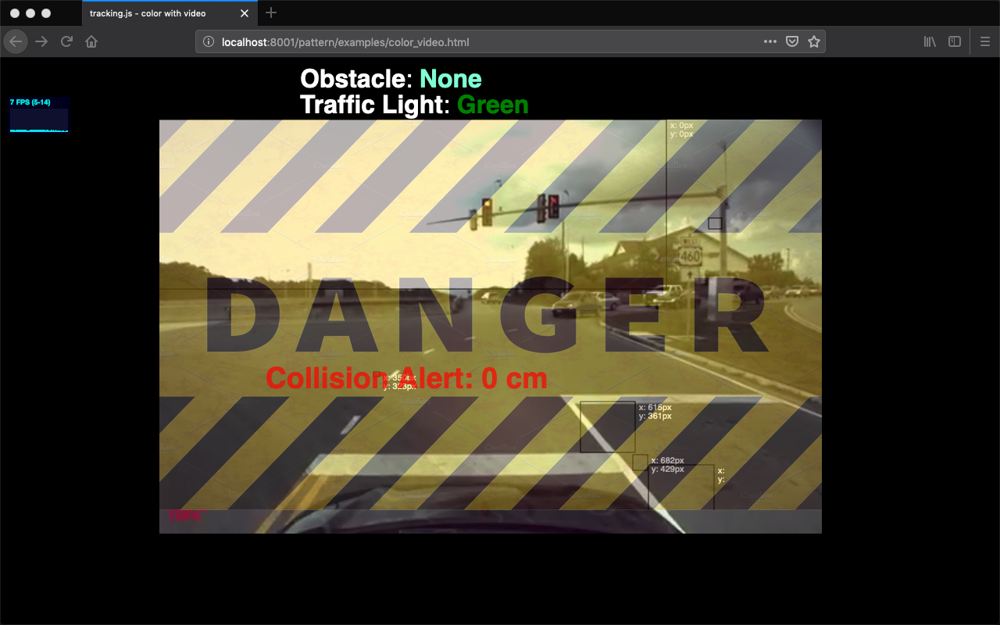
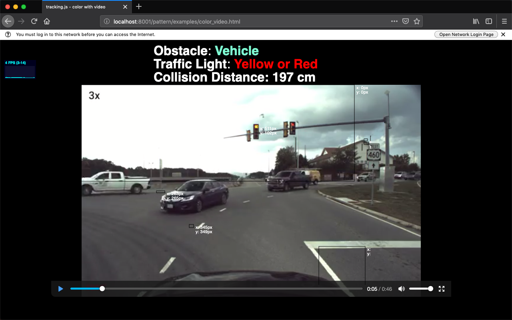

# Connection-of-arduino-to-node-js-
Connection of Arduino to Node.js using serial port
## Demo working:

 

# Steps:  
 <b> 1. Install Node and Express in your folder </b>

  
  npm init
  
  npm install 
  
 For installing express Setup:
 
  npm install express

 
 <b> 2. Setup for Serial Port using CLI Command: </b>
    
       npm install serialport
       
 <b> 3. Setup for Socket.IO: </b>
 
       npm install socket.io
       
 <b> I have also used Tracker.js. For more detail visit: https://trackingjs.com </b>
 
